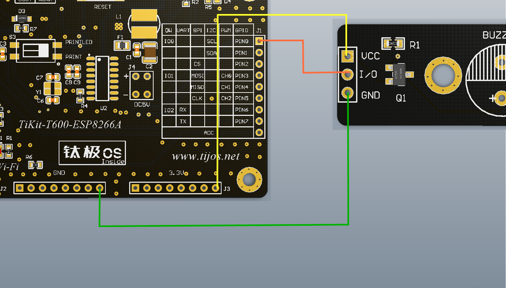

# TiBuzzer有源蜂鸣器功能例程

## 简介

本例程为TiBuzzer有源蜂鸣器的使用，对应目录如下：

- Buzzer

## 适用TiKit开发板 

1.TiKit-T600-ESP8266A

## TiKit-T600-ESP8266A与TiBuzzer连接说明 

### 电气连接

- GND<------>GND
- PIN0<------>I/O
- 3.3v <------>VCC

### 示意图 

### 注意事项

1. 连接TiBuzzer所使用的是GPIO功能， 由于硬件平台的启动方式的原因，不建议使用PIN2作为控制引脚。

2. 使用前请先确保连线的正确性，如电源线与地线接反，可能会损坏蜂鸣器并对TiKit造成一定损伤。

3. 实际应用中可根据需要改变GPIO的PIN脚与TiBuzzer的物理连接。

   ​

