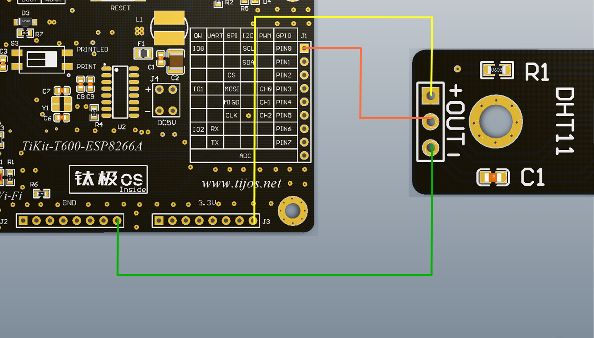

# TiDHT11数字温湿度传感器功能例程

## 简介

本例程为DHT11数字温度传感器的使用，对应目录如下：

- DHT11

## 适用TiKit开发板 

1.TiKit-T600-ESP8266A

## TiKit-T600-ESP8266A与TiDHT11连接说明 

### 电气连接

- GND<------>地（-）
- PIN0  <------>信号线（OUT）
- 3.3v <------>电源（+）

### 示意图

### 注意事项

1. 开发包驱动支持温湿度传感器DHT11，DHT22，可通过相应类里面的方法设置传感器的类型（默认为DHT11）。

2. 连接TiDHT11所使用的是GPIO功能， 由于硬件平台的启动方式的原因，因此不建议使用PIN2引脚作为数据引脚。

3. 使用前请先确保连线的正确性，如电源线与地线接反，会烧毁传感器并对TiKit造成一定损伤。

4. 为保证工作时序的正常，请在连接好传感器之后，再运行用户程序，否则有可能会造成总线时序混乱，接口报错、采集不准确等问题。

5. 实际应用中可根据需要改变GPIO的PIN脚与TiDHT11的物理连接。

   ​

