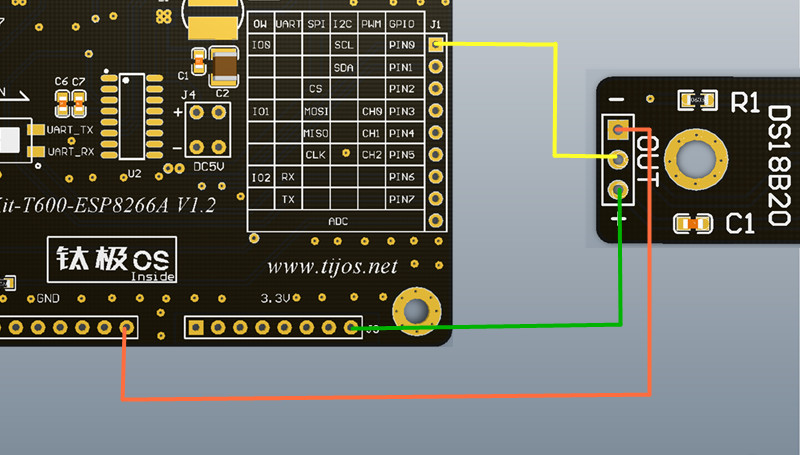

# TiDS18B20数字温度传感器功能例程

## 简介

本例程为DS18B20数字温度传感器的使用，对应目录如下：

- DS18B20

## 适用TiKit开发板 

1.TiKit-T600-ESP8266A

## TiKit-T600-ESP8266A与TiDS18B20连接说明 

### 电气连接

- GND<------>地（-）
- IO0  <------>信号线（OUT）
- 3.3v <------>电源（+）

### 示意图

### 注意事项

1. DS18B20温度传感器所使用的是单总线接口（onewire），对应TiKit上面可使用的接口为OW栏下的IO0，IO1，IO2。

2. 使用前请先确保连线的正确性，如电源线与地线接反，会烧毁传感器并对TiKit造成一定损伤。

3. 为保证工作时序的正常，请在连接好传感器之后，再运行用户程序，否则有可能会造成总线时序混乱，接口报错、采集不准确等问题。

   ​

