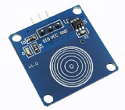

# TiGeneralSensor通用传感器功能例程

## 简介

本例程为通用传感器的使用，对应目录如下：

- GeneralSensor

## 适用TiKit开发板 

1.TiKit-T600-ESP8266A

## TiKit-T600-ESP8266A与TiDS18B20连接说明 

### 电气连接

- GND<------>地（-）
- 3.3v <------>电源（+）
- PIN0  <------>DO
- ADC <----->AO

## 传感器支持

本例程提供了如下类型传感器例程:

| 传感器      |                   图片                    | 例程                            |
| -------- | :-------------------------------------: | :---------------------------- |
| 火焰传感器    |    | FireSensorSample.java         |
| 光敏传感器    |  | LightSensorEventListener.java |
| 声音传感器    |  | SoundSensorEventListener.java |
| 土壤湿度传感 器 |    | SoilSensorSample.java         |
| 触摸按键     |  | TouchButtonSample.java        |
| 人体感应开关   |  | HumanSensorSample.java        |

### 注意事项

1. 通讯传感器即常见的4线或3线传感器， 类似传感器可参考此例程

2. 使用前请先确保连线的正确性，如电源线与地线接反，会烧毁传感器并对TiKit造成一定损伤。

3. 为保证工作时序的正常，请在连接好传感器之后，再运行用户程序，否则有可能会造成总线时序混乱，接口报错、采集不准确等问题。

   ​

