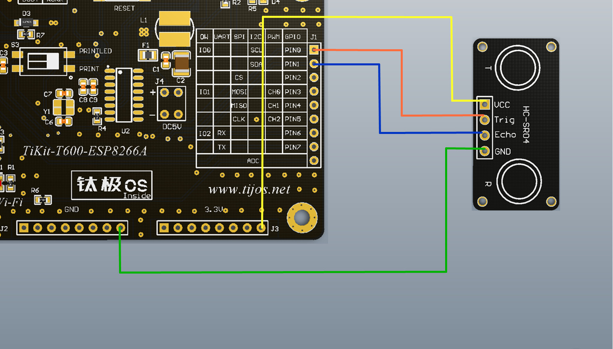

# TiHCSR04超声波测距传感器功能例程

## 简介

本例程为TiHCSR04超声波测距传感器的使用，对应目录如下：

- HCSR04

## 适用TiKit开发板 

1.TiKit-T600-ESP8266A

## TiKit-T600-ESP8266A与TiHCSR04连接说明 

### 电气连接

- GND<------>GND
- PIN0<------>Trig
- PIN1<------>Echo
- 3.3v <------>VCC

### 示意图

### 注意事项

1. 连接TiHCSR04所使用的是GPIO功能， 由于硬件平台的启动方式的原因，因此不建议使用PIN2引脚作为数据引脚。

2. 使用前请先确保连线的正确性，如电源线与地线接反，会烧毁传感器并对TiKit造成一定损伤。

3. 为保证工作时序的正常，请在连接好传感器之后，再运行用户程序，否则有可能会造成总线时序混乱，接口报错、采集不准确等问题。

4. 实际应用中可根据需要改变GPIO的PIN脚与TiHCSR04的物理连接。

5. 由于超声波测距波呈扩散型传播，因此，测试距离越远，需要测试的平面面积越大。

   ​

