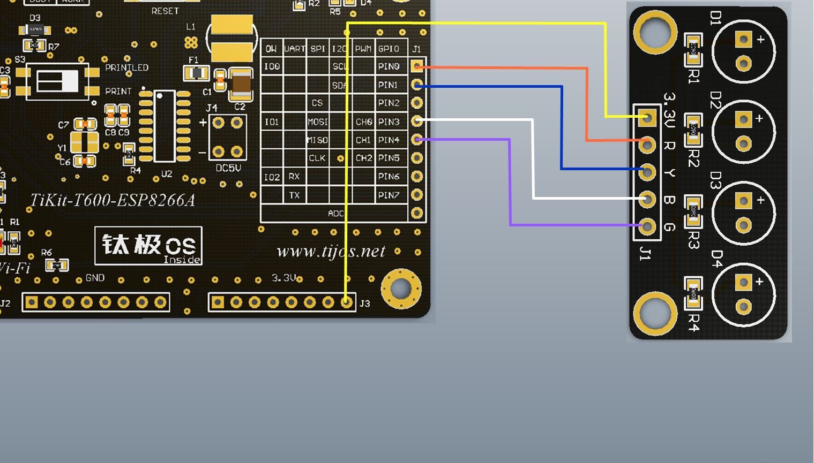

# TiLED四灯控制例程

## 简介

本例程为TiLED的四个LED灯的控制例程，对应目录如下：

- FourLED

## 适用TiKit开发板 

1.TiKit-T600-ESP8266A

## TiKit-T600-ESP8266A与TiLED连接说明

### 电气连接

- 3.3V<------>3.3V

- PIN0<------>R(红色灯)

- PIN1<------>Y(黄色灯)

- PIN3<------>B(蓝色灯)

- PIN4<------>G(绿色灯)

### 示意图

### 注意事项

1. 本例程为循环控制四个LED灯的亮灭，达到简易流水灯的的效果，每个灯都可以单独控制，用户可根据实际情况自由搭配；
2. PIN2在硬件平台启动时需要保持高电平，如必须使用该引脚，须注意硬件平台启动时该引脚的电平；