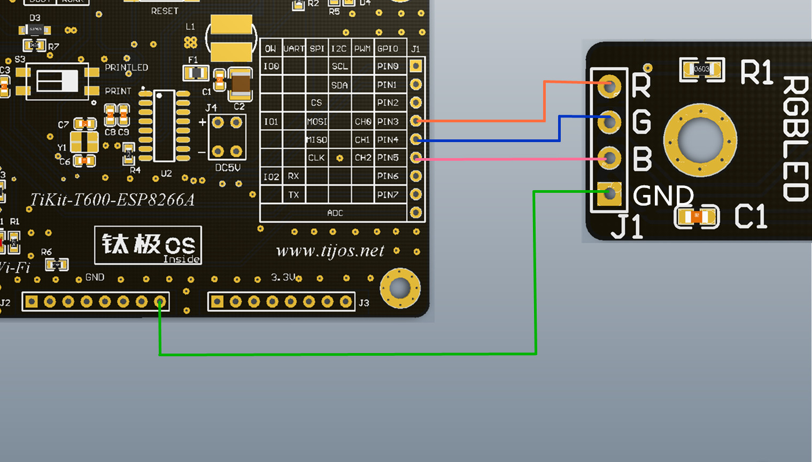

# TiRGBLED灯控制例程

## 简介

本例程为TiRGBLED三基色灯的控制例程，对应目录如下：

- RGBLED

## 适用TiKit开发板 

1.TiKit-T600-ESP8266A

## TiKit-T600-ESP8266A与TiRGBLED连接说明 

### 电气连接

- GND<------>GND

- CH0<------>R(红色通道)

- CH1<------>G(绿色通道)

- CH2<------>B(蓝色通道)

### 示意图

### 注意事项

1. TiRGBLED为三基色共阴极灯，注意接线时的对应关系，防止接错造成损坏；
2. 可根据实际需求，变换TiKit和三基色通道的组合方式。