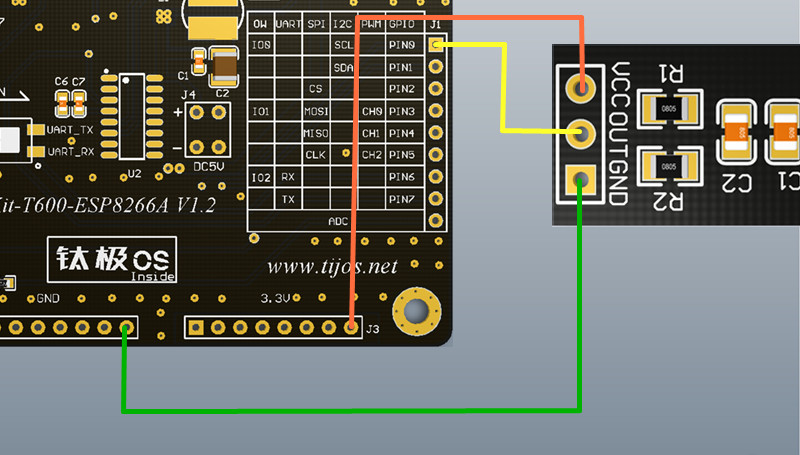

# TiVS1838BNEC红外遥控接收功能例程

## 简介

本例程为TiVS1838BNEC红外遥控接收的使用，编解码采用NEC码，对应目录如下：

- VS1838BNEC

## 适用TiKit开发板 

1.TiKit-T600-ESP8266A

## TiKit-T600-ESP8266A与TiVS1838BNEC连接说明 

### 电气连接

- GND<------>GND
- PIN0<------>Out
- 3.3v <------>VCC

### 示意图

### 注意事项

1. TiJOS红外接收处理使用事件方式，性能较高，可用在复杂业务逻辑中，详细使用方法请参考例程源代码。

2. 连接TiVS1838BNEC所使用的是GPIO功能， 由于硬件平台的启动方式的原因，因此不建议使用PIN2引脚作为数据引脚。

3. 使用前请先确保连线的正确性，如电源线与地线接反，会烧毁传感器并对TiKit造成一定损伤。

4. 实际应用中可根据需要改变GPIO的PIN脚与TiVS1838BNEC的物理连接。

5. 由于红外线具有方向性，因此，测试时请将遥控器正对红外接收头。

   ​