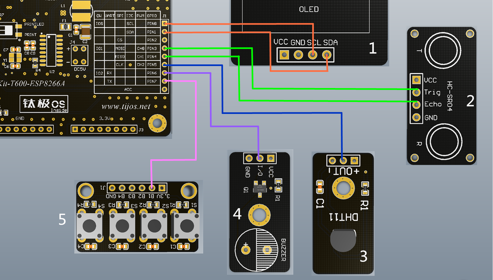

# Rangefinder多功能超声波测距仪例程

## 简介

超声波是频率高于20000赫兹的声波的统称，其具有方向性较好、传播速度快以及穿透性强等特点，被广泛用于测距、测速以及工业清洗等多种方向。超声波测距仪是基于超声波的反射原理，通过超声波的发射头发射固定频率的超声波信号，当声波遇到障碍物返回时，通过接收头接收，计算超声波发射到接到反馈的时间，根据声波的速度，即可测量出发射点到障碍物的距离。超声波用于测距的方案，目前已经被普及到小型手持设备中，由于其成本低廉、测量距离远以及稳定性好等特点，因此被用于多种测距场景。

本例程提供了一种带有实时环境状态监测的多功能超声波测距仪，例程中主要使用套件中的TiKit-T600-ESP8266A 主开发板以及以下模块：

1. 屏幕显示部分：TiOLED_UG2864 OLED显示模块；
2. 测距部分：TiHCSR04超声波测距模块；
3. 温湿度监测部分：TIDHT温湿度监测模块；
4. 声音提示部分：TIBuzzer蜂鸣器模块；
5. 按钮部分：TiButton按键模块。

通过使用相应的驱动包以及相关总线类，加以逻辑设计，超声波测距仪主要实现功能：

1. 温湿度实时监测、显示；

2. 实时测距并显示；

3. 按键锁定测距并保留测量值方便阅读；

4. 按键声音提示。

本例程可用于手持超声波测距仪的测距，开发者可根据实际需求自行扩展，例如：
1. 接入网络实时记录并上传测量记录；
2. 更换精度更好、测量距离更远的超声波传感器，可用于多种场景下的远距离测量；
3. 接入网络实时记录并上传测量记录，增加转向电机模块，可实现远距离定向测距，可用于高危特种作业环境的距离测量；
4. 可载入智能小车，作为避障源动态监测各方向离障碍物的距离。

目录如下：

- RangefinderSample

## 适用TiKit开发板 

1.TiKit-T600-ESP8266A

## TiKit-T600-ESP8266A 连接说明 - RangefinderSample

### 电气连接

1. 屏幕显示部分：TiOLED_UG2864
   - 3.3V<------>VCC
   - GND<------>GND
   - SDA<------>SDA
   - SCL<------>SCL
2. 测距部分：TiHCSR04
   - GND<------>GND
   - PIN3<------>Trig
   - PIN4<------>Echo
   - 3.3v <------>VCC
3. 温湿度监测部分：TiDHT：
   - GND<------>地（-）
   - PIN5  <------>信号线（OUT）
   - 3.3v <------>电源（+）
4. 声音提示部分：TIBuzzer蜂鸣器模块：
   - GND<------>GND
   - PIN6<------>I/O
   - 3.3v <------>VCC
5. 按钮部分：TiButton按键模块：
   - GND<------>GND
   - PIN7<------>B1(S1)

### 示意图

### 注意事项

1. 为了避免图中线条太多对用户阅读造成干扰，因此在上述示意图中，各部分与TiKit只连接了信号线，未将VCC和GND与各部分相连。用户在实际测试时，各部分的VCC（-）和GND（-）都需要依照**电气连接**部分的对照表一一对应连接。
2. 使用本例程时，由于各部分均与主板连接，因此需要格外注意模块的焊接点互相碰到，否则容易造成短路，烧毁器件。建议用户在使用时，将各部分的连接线整理好，将模块尽量隔离。